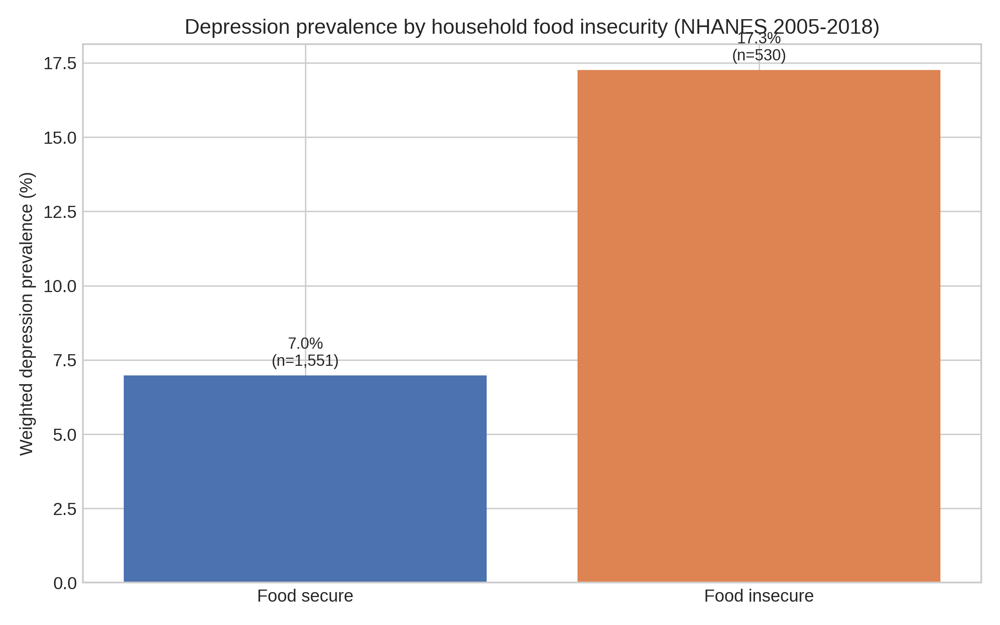
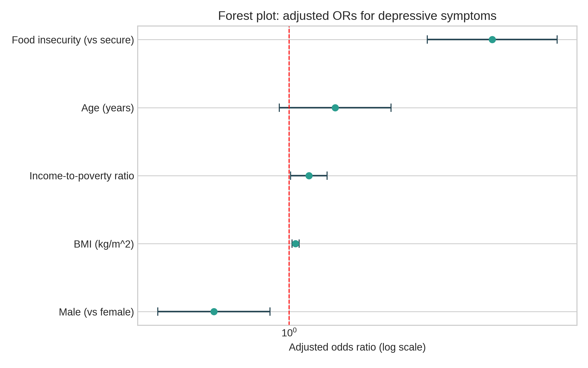
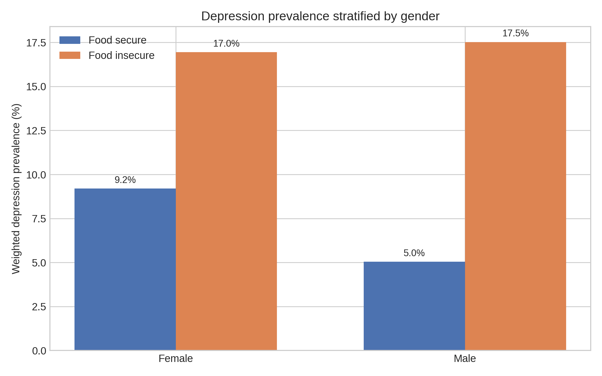
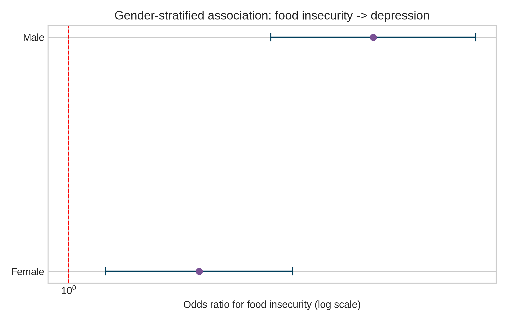

# Food Insecurity and Youth Depression Risk in the U.S.

Author: **Ao Xu**  
Repository: https://github.com/bobaoxu2001/Food-insecurity

## Project Objective

**Research question:**  
Does household food insecurity increase the risk of depressive symptoms among adolescents and youth in the United States?

---

## Data Source

Primary source: **NHANES (CDC)**  
https://www.cdc.gov/nchs/nhanes/

Pooled cycles used in this project:
- 2005-2006
- 2007-2008
- 2009-2010
- 2011-2012
- 2013-2014
- 2015-2016
- 2017-2018
- 2021-2022

Modules merged:
- DEMO (demographics, income, and survey weights)
- DPQ (PHQ-9 depression screening)
- FSQ (food security)
- BMX (BMI)

Note: food-security status uses `FSDHH` when available and `FSDAD` for cycles where `FSDHH` is not released.

---

## Methods

1. **Data cleaning**
   - Merge all modules by `SEQN`
   - Restrict to youth ages 12-19
   - Construct depression outcome: `PHQ-9 >= 10`
   - Construct binary food insecurity: low/very low vs full/marginal
   - Handle missing values with complete-case modeling
   - Apply pooled-cycle MEC weighting

2. **Statistical model**
   - Weighted logistic regression:
     - `Depression ~ Food_Insecurity + Age + Gender + Income + BMI`
   - Outputs:
     - Odds Ratio (OR)
     - 95% confidence interval
     - p-value

3. **Visualization**
   - Food insecurity vs depression prevalence
   - Adjusted OR forest plot
   - Gender-stratified prevalence and OR

---

## Reproducible Run

### 1) Install dependencies

```bash
python3 -m pip install --upgrade pip pandas statsmodels matplotlib seaborn scipy requests
```

### 2) Run the full pipeline

```bash
python3 scripts/run_project.py
```

This script automatically:
- Downloads NHANES XPT files
- Cleans and merges data
- Fits weighted logistic models
- Exports tables and figures
- Generates the final PDF report

---

## Key Outputs

- Final report PDF  
  `report/Food_Insecurity_Youth_Depression_Risk_Ao_Xu_2005_2022.pdf`
- Processed datasets  
  `data/processed/`
- Tables  
  `outputs/tables/`
- Figures  
  `outputs/figures/`
- SQL merge template  
  `sql/merge_nhanes_template.sql`

---

## Current Run Snapshot

From the latest run:
- Combined sample (all ages): **82,123**
- Youth sample (12-19): **11,659**
- Complete-case analytic sample: **2,081**
- Weighted depression prevalence:
  - Food secure: **6.98%**
  - Food insecure: **17.27%**
- Main adjusted association (food insecurity -> depression):
  - **OR = 3.04**
  - **95% CI: 2.13-4.34**
  - **p < 0.001**

---

## Key Figures

### Figure 1. Depression prevalence by food insecurity


### Figure 2. Adjusted odds-ratio forest plot


### Figure 3. Gender-stratified prevalence


### Figure 4. Gender-stratified food insecurity effect


These same figures are also included in the PDF report.

---

## Report Structure

The generated PDF includes:
- Background
- Literature Review
- Methods
- Data Processing
- Statistical Analysis
- Results
- Discussion
- Public Health Implications
- Limitations
- Future Research